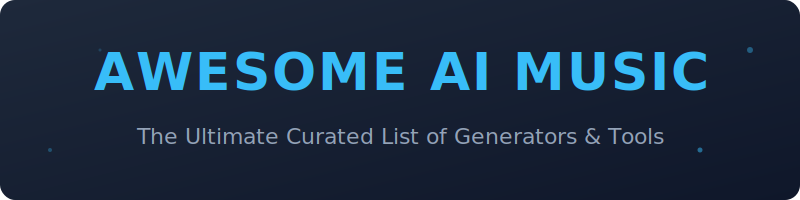

  

  <h1>Awesome AI Music Generators 🎵</h1>

  

    
    
    
    
    
  

 
 
  

  
<b>The ultimate curated list of AI Music Generators, Text-to-Music tools, and AI Composition ecosystems.</b>

  
  
Discover the best <b>SaaS platforms</b> like Suno and Udio, and powerful <b>Open-Source</b> projects like MusicGen and Stable Audio Open. Perfect for musicians, content creators, and developers building the future of audio.

---

## 🚀 Quick Links
- ☁️ **[SaaS Products](#-saas-products)** - Cloud-based AI music platforms.
- 💻 **[Open-Source Projects](#-open-source-github-projects)** - Self-hosted models and frameworks.
- 📄 **[Scientific Papers](#-scientific-papers--implementations)** - Research and foundational models.
- 🤝 **[How to Contribute](#-how-to-contribute)** - Join the community!

---

## ☁️ SaaS Products

### Core Platforms (AI Music Generators) 🎹

| Product | Description | Pricing | Free Tier Limit | Company Size (Est. Valuation / Revenue) |
| :--- | :--- | :--- | :--- | :--- |
| **[Suno](https://suno.com/)** | 🌟 Leading AI music generator known for high-quality full songs, viral hits, and extensive style library. | Starts at $10/mo. | 50 daily credits (~10 songs) | $5.4B Valuation / $300M ARR |
| **[Udio](https://www.udio.com/)** | 🔥 Top-tier AI music generator known for realistic vocals, strong prompt adherence, and excellent stem separation. | Starts at $10/mo. | 10 daily + 100 monthly credits | $5.4B Valuation / $3.1M ARR |
| **[Mureka](https://www.mureka.ai/)** | 🌐 Creative platform built on MusiCoT, generating complete songs with full vocal/lyrics/style customization. | Paid packs / subscription | Limited daily credits (~2-3 songs) | $100M+ Parent ARR (Kunlun Tech) |
| **[Soundful](https://soundful.com/)** | 💎 High-quality AI music generator focused on commercial use and professional sound design. | Starts at $4.99/mo. | 1 MP3 download/mo | $7.5M Revenue / $4M+ Funding |
| **[Beatoven.ai](https://www.beatoven.ai/)** | 🧘 AI composer specializing in background music and mood-based generation for videos and podcasts. | Starts at $6/mo. | Unlimited generation (no downloads) | $8M Valuation / $2.5M ARR |
| **[Boomy](https://boomy.com/)** | 🚀 Easy-to-use platform for creating and releasing AI-generated songs with distribution options. | Starts at $9.99/mo. | 25 song saves, 1 release | $5.38M Funding |
| **[SOUNDRAW](https://soundraw.io/)** | 🎬 Professional AI music platform focused on royalty-free tracks for videos, games, and content with fine-grained control. | Starts at ~$11/mo. | Unlimited preview (no downloads) | $5M Funding |
| **[Mubert](https://mubert.com/)** | 🎨 Generative music platform creating endless royalty-free tracks and soundscapes using AI. | Starts at ~$14/mo. | 25 generations / 5 downloads (requires attribution) | $2.6M Funding |
| **[AIVA](https://www.aiva.ai/)** | 🏛️ Pioneering AI composer capable of creating emotional and cinematic music in various genres. | Starts at €15/mo. | 3 downloads/mo (non-commercial) | $2.48M Funding |
| **[Musicfy](https://musicfy.lol/)** | 🎤 User-friendly AI music generator with voice cloning, lyrics generation, and extensive library of styles. | Starts at $9.99/mo. | 10 monthly credits (15s limit) | $2M+ ARR |
| **[Loudly](https://www.loudly.com/)** | 🎧 Collaborative AI music creation platform with real-time generation and strong customization options. | Starts at $10/mo. | 30s limit, limited downloads | $1.97M Revenue |
| **[MusicGPT](https://musicgpt.com/)** | 🎹 Complete AI music studio generating full tracks with vocals, lyrics, and DAW-friendly editing capability. | Starts at $9.99/mo. | 500 credits/mo (personal use) | Growth Stage / Bootstrapped |
| **[Tad AI](https://tad.ai/)** | ⚡ Rapidly growing AI music generator focused on simplicity and fast song creation from text. | Starts at $7.99/mo. | ~20 credits (~4 songs) | < $1M Est. (Early Stage) |

### Advanced & Specialized Platforms 🛠️

**Other notable mentions**: Voicemod AI Music, Suno (implied), and various genre-specific tools.

---

## 💻 Open-Source GitHub Projects

### Dedicated AI Music Generation Projects 🛠️

- **[MusicLM / AudioLM inspired models](https://github.com/google-research/google-research/tree/master/musiclm)**  🧠  
  Various open implementations and improvements of Google's music generation research.

- **[Ultimate Vocal Remover (UVR)](https://github.com/Anjok07/ultimatevocalremovergui)**  🧼  
  Popular GUI for stem separation.

- **[Audiocraft / MusicGen](https://github.com/facebookresearch/audiocraft)**  🎼  
  Meta's powerful open-source framework for music and audio generation. Includes MusicGen models capable of high-quality text-to-music generation.

- **[Magenta](https://github.com/magenta/magenta)** (Google)  🤖  
  Comprehensive open-source research platform for music and art generation with many models and tools.

- **[Tortoise TTS](https://github.com/neonbjb/tortoise-tts)** (with music extensions)  🐢  
  High-quality voice and audio generation that can be combined with music models for full track creation.

- **[ACE-Step 1.5](https://github.com/ace-step/ACE-Step-1.5)**  ⚡  
  Outstanding local-first AI music generation framework with user-friendly web UI.

- **[Demucs](https://github.com/facebookresearch/demucs)**  🥁  
  Leading open-source music source separation model (v4) for splitting vocals, drums, bass, and other stems.

- **[Jukebox (OpenAI)](https://github.com/openai/jukebox)** (and modern forks)  📻  
  Pioneering autoregressive music generation model with many community fine-tunes.

- **[YuE](https://github.com/multimodal-art-projection/YuE)**  🌟  
  Open-source foundation model for full-song music generation capable of high-fidelity vocal and music synthesis.

- **[DiffSinger](https://github.com/MoonInTheRiver/DiffSinger)** (with DiffRhythm)  🎤  
  Singing voice synthesis models.

- **[Stable Audio Open](https://github.com/Stability-AI/stable-audio-tools)**  🔊  
  Open-source version of Stability AI’s music generation model for high-fidelity audio synthesis from text.

- **[Riffusion](https://github.com/riffusion/riffusion-app)**  🌈  
  Stable Diffusion adapted for music generation by converting spectrograms. Enables real-time text-to-music and style transfer.

- **[Open-Unmix](https://github.com/sigsep/open-unmix)**  ✂️  
  State-of-the-art source separation (stems) tool essential for AI music post-processing.

- **[DiffRhythm](https://github.com/ASLP-lab/DiffRhythm)**  🥁  
  Fast and simple full-length song generation using non-autoregressive latent diffusion.

### Additional Strong Open-Source Options 🚀

- **Many GGUF / quantized versions** of MusicGen, Stable Audio, and Riffusion optimized for local inference. 📦
- **LangChain + Audiocraft** pipelines for agentic music generation workflows. 🔗

---

## 📄 Scientific Papers & Implementations

Explore the research behind the magic. 🧪

| Model | Year | Paper | GitHub Implementation | Type |
| :--- | :--- | :--- | :--- | :--- |
| **MusicGen** | 2023 | [Simple and Controllable Music Generation](https://arxiv.org/abs/2306.05284) | [facebookresearch/audiocraft](https://github.com/facebookresearch/audiocraft) | Audio |
| **YuE** | 2025 | [YuE: Open Music Foundation Models for Full-Song Generation](https://arxiv.org/abs/2503.08638) | [multimodal-art-projection/YuE](https://github.com/multimodal-art-projection/YuE) | Audio |
| **Stable Audio Open** | 2024 | [Stable Audio Open](https://arxiv.org/abs/2407.14358) | [Stability-AI/stable-audio-tools](https://github.com/Stability-AI/stable-audio-tools) | Audio |
| **DiffRhythm** | 2025 | [DiffRhythm: Fast and Simple Full-Length Song Generation](https://arxiv.org/abs/2503.01183) | [ASLP-lab/DiffRhythm](https://github.com/ASLP-lab/DiffRhythm) | Audio |
| **Mustango** | 2023 | [Mustango: Toward Controllable Text-to-Music Generation](https://arxiv.org/abs/2311.08306) | [AMAAI-Lab/mustango](https://github.com/AMAAI-Lab/mustango) | Audio |
| **TANGO** | 2023 | [TANGO: Text-to-Audio Generation with Latent Diffusion](https://arxiv.org/abs/2304.13731) | [declare-lab/tango](https://github.com/declare-lab/tango) | Audio |
| **MusicLM** | 2023 | [MusicLM: Generating Music From Text](https://arxiv.org/abs/2301.11325) | [lucidrains/musiclm-pytorch](https://github.com/lucidrains/musiclm-pytorch) | Audio |
| **AudioLM** | 2022 | [AudioLM: a Language Modeling Approach to Audio Generation](https://arxiv.org/abs/2209.03143) | [lucidrains/audiolm-pytorch](https://github.com/lucidrains/audiolm-pytorch) | Audio |
| **MuseGAN** | 2017 | [MuseGAN: Multi-track Sequential Generative Adversarial Networks](https://arxiv.org/abs/1709.06298) | [salu133445/musegan](https://github.com/salu133445/musegan) | Symbolic |
| **Amphion** | 2023 | [Amphion: An Open-Source Toolkit for Audio, Music, and Speech Generation](https://arxiv.org/abs/2312.09911) | [open-mmlab/Amphion](https://github.com/open-mmlab/Amphion) | Toolkit |

---

## 🤝 How to Contribute

We love contributions! Follow these steps to add a new tool or model:

1. 🍴 **Fork the repo**.
2. ➕ **Add/edit entries** in `README.md` (keep it alphabetical where possible).
3. 📝 **Include**: Name, link, 1–2 sentence description, and SaaS/Open-Source status.
4. 🚀 **Submit a PR** with a brief summary of your changes.

---

## ⚠️ Disclaimer

- This is a **community-curated** list — not exhaustive and not an endorsement.
- Generated music may have copyright considerations. Always check licenses for commercial use. ⚖️
- Self-hosted models often require a capable GPU (VRAM) for optimal performance. ⚡

---

## 📈 Star History

  <a href="https://star-history.com/#ishandutta2007/Awesome-AI-Music-Generators&Date">
    <picture>
      <source media="(prefers-color-scheme: dark)" srcset="https://api.star-history.com/chart?repos=ishandutta2007/Awesome-AI-Music-Generators&type=date&theme=dark" />
      <source media="(prefers-color-scheme: light)" srcset="https://api.star-history.com/chart?repos=ishandutta2007/Awesome-AI-Music-Generators&type=date" />
      
    </picture>
  </a>

---

  <b>Made with ❤️ for musicians, producers, and AI audio enthusiasts.</b> 
  <i>Let's make music creation more accessible, creative, and fully controllable.</i>

